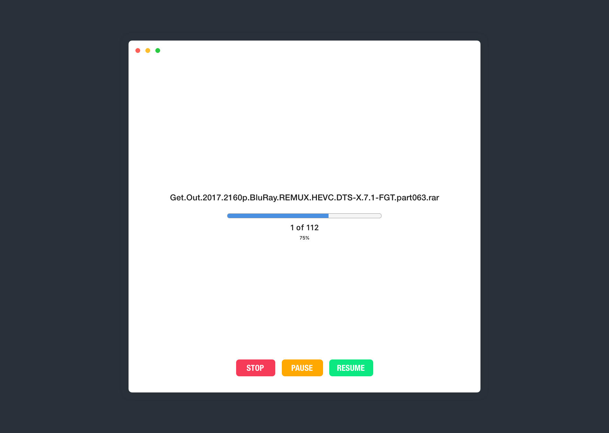

# SNAHP Tool
> For those people that are using snahp and zippyshare

## Installation 
Download the [latest release](https://github.com/rawnly/snahp-tool/releases/latest), unzip and install it!

### Notes:
At the time of this writing the application has been tested only on **MacOS 13.13.3**. It will be soon release for other platforms.